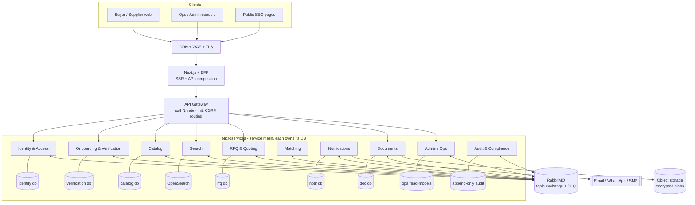
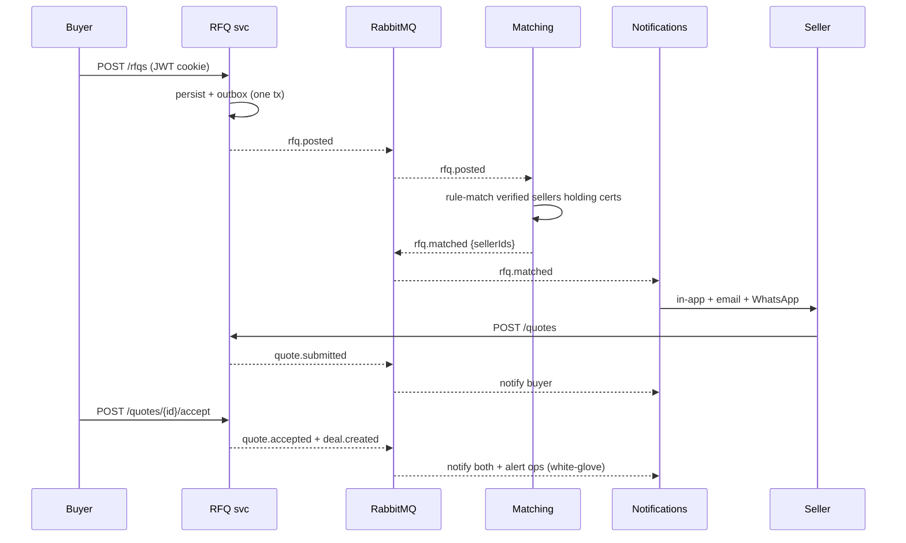
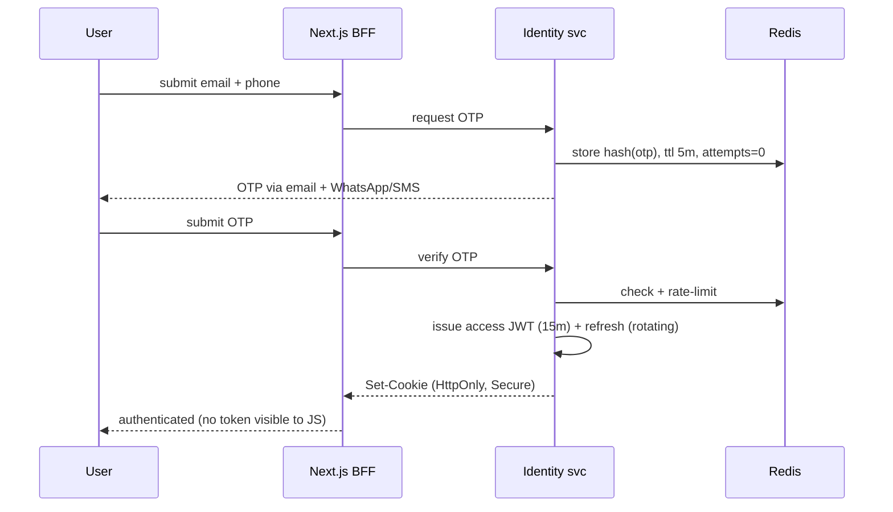
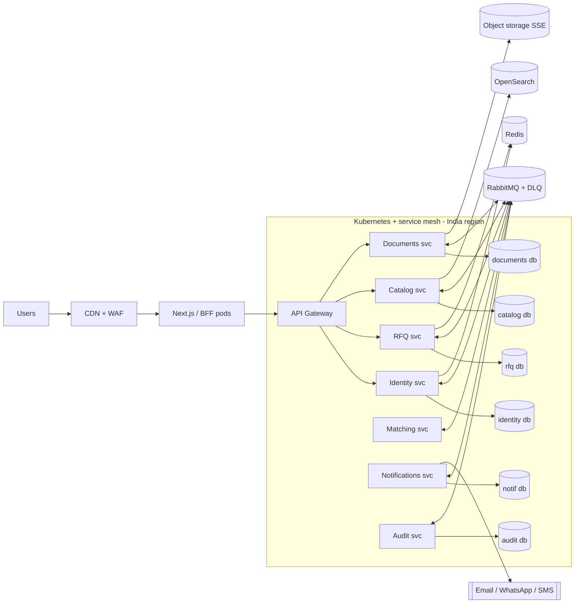

# PharmaLink Global — Implementation Architecture

**Scope:** How the MVP (and roadmap) is actually built. Event-driven, message-queue backbone, full-stack web app, JWT + secure-cookie session management, and the application changes required for GDPR / India DPDP and pharma-trade compliance.
**Companion docs:** `BACKLOG.md` (what to build), `index.html` (UI mock + Workflows tab). Story/feature IDs (F0–F7, R1–R37, G1–G15) map back to the backlog.

---

## 1. Principles

1. **Spine-first, event-driven.** Services own their data and communicate through **domain events on a message broker**. Synchronous calls only where a user is blocked waiting (auth, read APIs); everything else (notifications, matching, indexing, audit, SLA timers) is asynchronous.
2. **Microservices from day one.** Each bounded context is an **independently deployable service with its own database** — no shared schema, no service reaching into another's data. Services integrate **async-first** through domain events on the broker, with a thin API gateway for user-facing reads. Deliberately **right-sized**: ~10 services for the MVP, not dozens of nano-services — split by business capability and team ownership, not by table.
3. **Trust is the product.** Verification, document integrity, audit trail and access control are first-class, not add-ons (mirrors the MVP thesis: human-verified GMP certs + ops, not AI/blockchain).
4. **Secure & compliant by default.** HttpOnly secure cookies, encryption in transit + at rest, least-privilege RBAC, full audit log, consent + DSAR from day one.
5. **Reliability over cleverness.** Transactional outbox, idempotent consumers, dead-letter queues, retries with backoff. At-least-once delivery + idempotency = effectively-once processing.

---

## 2. System context & containers (C4-ish)



> **Database per service** is the load-bearing rule: no service queries another's DB. A service needs data it does not own? It **subscribes to events** and keeps a local **read model**. Sync calls between services are the exception (gRPC), used only when a caller genuinely must block.

---

## 3. Full-stack technology choices

| Layer | Choice (MVP) | Why / notes |
|---|---|---|
| **Frontend** | Next.js (React, TypeScript) | SSR/SSG for SEO on public product & supplier pages (F1.3–F1.5, the organic-growth engine); the existing design system ports directly. |
| **BFF / API composition** | Next.js Route Handlers | Thin backend-for-frontend: sets/reads secure cookies, composes reads across services, never exposes tokens to JS. |
| **Services** | NestJS (Node/TS), **one service per bounded context** | ~10 independently deployable services; own DB each; AMQP for events + gRPC for the rare sync call; own CI/CD pipeline. |
| **API Gateway** | Kong / APISIX (or cloud API gateway) | Single ingress: JWT verification, RBAC, rate-limit, CSRF, request routing to services. |
| **Service mesh** | Istio / Linkerd | **mTLS between services**, retries, timeouts, circuit breaking, traffic shifting (canary), east-west observability. |
| **Orchestration** | Kubernetes | One Deployment per service; independent scaling and rollout; HPA per service. |
| **Message broker** | **RabbitMQ** (topic exchange, DLX, delayed-message plugin) | The async integration backbone: routing, work queues, dead-lettering, delayed delivery for SLA timers. Managed equivalents map 1:1 → Azure Service Bus, AWS SNS+SQS, GCP Pub/Sub. Kafka added in Phase 3 for the high-volume audit/analytics event log. |
| **Databases** | PostgreSQL 16 — **one database per service** | Each service owns its DB; no cross-service DB access; row-level security; JSONB for flexible specs. Cross-service data via events → local read models. |
| **Cache / ephemeral** | Redis | OTP store, refresh-token rotation family, rate-limit counters, idempotency keys, server-side session index. |
| **Object storage** | S3-compatible (AWS S3 / Azure Blob / MinIO) | Certs, CoAs, spec docs — private, SSE-encrypted, served via short-TTL signed URLs. |
| **Search** | Postgres FTS (MVP) → OpenSearch (Phase 2) | Keyword + filter now; faceted/relevance search later. |
| **Notifications** | Transactional email (SES/Postmark) + WhatsApp Business API (Meta/Gupshup/Twilio) + SMS | WhatsApp materially outperforms email in India (F5.3); start API approval week 1. |
| **Scheduler** | RabbitMQ delayed messages + a cron worker (or Temporal in Phase 2) | SLA countdowns, cert-expiry reminders (60/30/7), RFQ nudges, quote-validity expiry. |
| **Infra** | Docker → Azure Container Apps / Kubernetes; Terraform/Bicep IaC; GitHub Actions CI/CD | Matches an ops-light 6-week build; scales to services later. |
| **Observability** | OpenTelemetry → Grafana/Loki/Tempo (or Datadog); structured JSON logs (no PII) | Traces across the event bus via correlation IDs. |
| **Secrets** | Cloud KMS / Key Vault | JWT signing keys, DB creds, provider API keys, envelope-encryption DEKs. |

---

## 4. Services (one per context) → backlog mapping

Each row is a **separately deployable microservice with its own database**. Services never share a DB; they exchange data via the events in the *Publishes* / *Consumes* columns.

| Service | Own DB | Publishes | Consumes | Backlog |
|---|---|---|---|---|
| **Identity & Access** | `identity` | `user.registered`, `session.created`, `session.revoked` | — | F0.2, F0.3, F7.1 |
| **Onboarding & Verification** | `verification` | `seller.submitted`, `seller.verified/rejected`, `buyer.kyb.*` | `document.uploaded` | F2, F3, F6.1, G2 |
| **Catalog** | `catalog` | `product.published/updated/unpublished` | `seller.verified` | F1, F2.4 |
| **Search** | OpenSearch index | — | `product.*`, `seller.verified` | F1.5 |
| **RFQ & Quoting** | `rfq` | `rfq.posted`, `quote.submitted`, `quote.accepted`, `deal.created` | `seller.verified`, `buyer.kyb.verified`, `rfq.matched` | F4 |
| **Matching** | stateless (+ read model) | `rfq.matched` | `rfq.posted`, `product.*`, `seller.verified` | F4.2 |
| **Notifications** | `notif` | `notification.dispatched` | almost everything (fan-out) | F5 |
| **Documents** | `documents` | `document.uploaded`, `document.accessed` | — | F2.3, F7.2 |
| **Admin / Ops** | `ops` (read models) | `listing.moderated`, `user.impersonated` | verification + RFQ events | F6 |
| **Audit & Compliance** | `audit` (append-only) | `dsar.requested`, `data.exported/erased` | **all** events (`#`) | F0.7, F7.3 |
| *Phase 2 services:* Escrow/Payments, Orders, Disputes, Ratings, Billing | one DB each | `escrow.*`, `order.*`, `dispute.*`, `review.published`, `invoice.issued` | `quote.accepted`, `order.delivered` | R1–R10 |

> The **Search** service keeps its index eventually-consistent by consuming catalog events — a textbook example of the database-per-service + read-model pattern. **Matching** is a pure event consumer holding a lightweight read model of verified sellers + their certs.

---

## 5. Event-driven architecture & message queue

### 5.1 Broker topology (RabbitMQ)

- **Exchange** `pharmalink.events` — `topic`, durable.
- **Routing key** convention: `<context>.<entity>.<event>` — e.g. `rfq.rfq.posted`, `verification.seller.verified`, `catalog.product.published`.
- **Queues** (durable, one per consumer group), bound by pattern:
  - `notifications.q` ← `rfq.*.*`, `quote.*.*`, `verification.*.*` (channel fan-out)
  - `matching.q` ← `rfq.rfq.posted`
  - `search-indexer.q` ← `catalog.product.*`
  - `audit.q` ← `#` (everything — compliance)
  - `scheduler.q` ← delayed messages (SLA/expiry)
- **Dead-lettering:** every queue has `x-dead-letter-exchange = pharmalink.dlx`; a `*.dlq` collects poison messages for inspection + replay.
- **Retries:** transient failures re-queued via the delayed-message exchange with exponential backoff (e.g. 5s, 30s, 5m), capped, then → DLQ.

### 5.2 Event envelope (standard)

```json
{
  "id": "evt_01J8Z...",              // ULID — the idempotency / dedupe key
  "type": "rfq.posted",
  "version": 1,
  "occurredAt": "2026-07-15T12:00:00Z",
  "actor":  { "userId": "usr_9f2", "orgId": "org_cipla" },
  "correlationId": "rfq_2041",       // ties an end-to-end flow together in traces
  "causationId": "evt_01J8Y...",     // the event that caused this one
  "data": { "rfqId": "rfq_2041", "productCas": "103-90-2", "certs": ["US FDA GMP","WHO PQ"] }
}
```

### 5.3 Reliability patterns

- **Transactional outbox (per service).** A service writes its state change **and** the event row to an `outbox` table in **its own DB** in one transaction. A relay (poller or Debezium CDC) publishes unsent rows to RabbitMQ, then marks them sent. This is how a service atomically updates its data and publishes an event without a distributed transaction — no lost events, no dual-write inconsistency.
- **Idempotent consumers.** Each consumer records processed `event.id` (Redis set / dedupe table); re-delivery is a no-op. At-least-once + idempotency = effectively-once.
- **Sagas / process managers.** Long-running flows are choreographed by events; a process manager tracks state and issues compensating actions on failure. MVP: RFQ lifecycle (`Draft→Open→Quoted→Accepted/Expired`). Phase 2: escrow saga (`accepted→funded→shipped→delivered→released` with dispute compensation).

### 5.4 Core loop as events — RFQ → Quote → Deal



### 5.5 Time-driven events (scheduler)

SLA + lifecycle timers are **delayed messages**, not cron scans: on `rfq.posted`, publish a `rfq.sla.check` delayed 24h; on `quote.submitted`, a `quote.expiry` at validity date; on `seller.verified`, `cert.expiry.reminder` at −60/−30/−7 days. Fires → consumer acts (nudge, expire, remind). This powers F4.7, F6.3, F6.5 and Phase-2 R4.

---

## 6. Authentication, sessions & secure cookies

### 6.1 Login (passwordless OTP, dual-channel)



### 6.2 Tokens

- **Access token** — JWT, **RS256** (asymmetric; private key in KMS, public JWKS for verification), **~15 min** TTL. Claims:

```json
{
  "iss": "https://api.pharmalink.global",
  "sub": "usr_9f2",            // user id
  "org": "org_cipla",          // organization
  "roles": ["buyer"],          // buyer | seller | both | admin (+ P2 team roles)
  "kyb": "verified",           // verification gate — unverified cannot post RFQs / receive them
  "sid": "sess_7ab",           // session id → server-side revocation
  "scope": "rfq:write quote:read catalog:read",
  "iat": 1721040000,
  "exp": 1721040900
}
```

- **Refresh token** — opaque, high-entropy, **rotating** (7–30 days). Stored **hashed** in Redis/DB with a *family id*. On refresh, the old token is invalidated and a new one issued; **reuse of a rotated token ⇒ the whole family is revoked** (stolen-token detection). Logout and "sign out everywhere" clear the family / `sid`.

### 6.3 Secure cookie strategy

Tokens live in cookies, **never** in `localStorage` (XSS-exfiltration risk). The BFF sets them; JS cannot read the auth tokens.

| Cookie | Contents | `HttpOnly` | `Secure` | `SameSite` | `Path` | Max-Age |
|---|---|---|---|---|---|---|
| `pl_at` | access JWT | ✅ | ✅ | `Lax` | `/` | 15 min |
| `pl_rt` | refresh token | ✅ | ✅ | `Strict` | `/api/auth` | 7 d |
| `pl_csrf` | CSRF token (double-submit) | ❌ (JS reads it) | ✅ | `Strict` | `/` | 15 min |

```ts
// BFF sets cookies after auth
res.cookie('pl_at', accessJwt, {
  httpOnly: true, secure: true, sameSite: 'lax',
  domain: '.pharmalink.global', path: '/', maxAge: 15 * 60_000,
});
res.cookie('pl_rt', refreshToken, {
  httpOnly: true, secure: true, sameSite: 'strict',
  path: '/api/auth', maxAge: 7 * 864e5,        // scoped to the refresh endpoint only
});
res.cookie('pl_csrf', csrfToken, {              // readable by JS → sent back in header
  httpOnly: false, secure: true, sameSite: 'strict', maxAge: 15 * 60_000,
});
```

- **CSRF defence:** `SameSite` + **double-submit** — every state-changing request must echo `pl_csrf` in an `X-CSRF-Token` header; the server compares header vs cookie. Cookies alone (auto-sent) are never sufficient authorization for writes.
- **Admin/ops** get `SameSite=Strict` on the access cookie and **mandatory MFA** (TOTP/WebAuthn); impersonation is time-boxed, banner-flagged and audited.
- **Silent refresh:** on `401`, the frontend calls `/api/auth/refresh` (only that path receives `pl_rt`); success rotates tokens and replays the request.

### 6.4 Authorization (RBAC + gates)

Enforced at the **gateway** (coarse: role/scope) and **per-service** (fine: resource ownership + verification gate).

| Capability | Buyer | Seller | Both | Admin | Gate |
|---|:--:|:--:|:--:|:--:|---|
| Browse public catalog | ✅ | ✅ | ✅ | ✅ | — |
| Post RFQ | ✅ | — | ✅ | — | `kyb=verified` |
| Receive RFQ / submit quote | — | ✅ | ✅ | — | `kyb=verified` |
| Download counterparty docs | ✅ | ✅ | ✅ | ✅ | verified **and** party to the RFQ |
| Verify / reject / moderate | — | — | — | ✅ | + MFA, audit |

---

## 7. Data architecture

- **Database per service.** Each service owns a private PostgreSQL database (`identity`, `verification`, `catalog`, `rfq`, `documents`, `ops`, `audit`, …). **No service reads another's database** — the single most important rule that keeps services independently deployable. A service that needs data it doesn't own subscribes to events and maintains a **local read model** (CQRS-style); there are no cross-service joins and no shared tables.
- **Row-Level Security** scopes rows to `org_id` within each service DB for defence-in-depth.
- **Distributed data consistency** is **eventual**, reconciled by events; multi-service operations that must be atomic use **sagas** (§5.3) with compensating actions, never a distributed transaction.
- **Documents:** uploaded to private object storage, server-side encrypted (SSE-KMS). The DB stores only metadata + **SHA-256 hash** (integrity; the interim of the Phase-3 blockchain registry, R18). Downloads issue a **signed URL, TTL ≤ 5 min**, only to a logged-in **verified counterparty**, and emit `document.accessed` → audit.
- **Field-level encryption** (envelope, KMS DEK) for the most sensitive PII — drug-licence, GST/CIN, DUNS — so a DB dump alone leaks nothing usable.
- **Audit store:** append-only table, **hash-chained** (each row carries `prev_hash`) for tamper-evidence; write-only for services, read-only for ops.

---

## 8. Compliance & the required application changes

Regulatory frame: **GDPR** (EU buyers), **India DPDP Act 2023** (India-first launch), plus **pharma-trade** obligations. Below, each control and the concrete change it forces in the application.

### 8.1 Data-protection controls (GDPR / DPDP)

| Obligation | Control | Application change |
|---|---|---|
| Lawful basis & **consent** | Explicit, granular, versioned consent; separate marketing opt-in | **Cookie-consent banner** (essential vs analytics/marketing — analytics scripts load only after opt-in); **consent step in onboarding**; consent records in the audit store |
| **Right of access / portability** | Self-service export of personal data | `POST /api/privacy/export` → async `dsar.requested` job → signed download of a JSON/CSV bundle; **"Download my data"** in account settings |
| **Right to erasure** | Account deletion + retention rules | `DELETE /api/account` → soft-delete, then **crypto-shred** (destroy the record's DEK) at retention end; transactional/legal records retained per statute, PII redacted |
| **Data minimization & retention** | Per-data-type retention schedule | Scheduled purge events (§5.5); collect only what a flow needs |
| **Data residency (DPDP)** | India-region primary data plane | Primary Postgres + blob storage in an **India region**; cross-border access for international buyers governed by **SCCs**; residency documented in the ROPA |
| **Security (GDPR Art 32 / DPDP safeguards)** | Encryption, RBAC, MFA, audit | TLS 1.2+; AES-256 at rest; HttpOnly/Secure cookies; admin MFA; hash-chained audit log |
| **Breach notification** | Detect → assess → notify | Incident runbook + a `security.incident` workflow with regulator/data-principal notification templates and SLAs |
| **Accountability** | Records of processing (ROPA), DPO, DPAs | ROPA maintained; **DPAs** with email/WhatsApp/SMS/(Phase-2 payment) sub-processors |

### 8.2 Pharma / trade-compliance controls

| Concern | Control | Phase |
|---|---|---|
| **Document authenticity** | SHA-256 hash on upload; verify-by-hash page; permissioned-ledger anchoring later (R18) | MVP hash → P3 ledger |
| **Supplier qualification records** | Questionnaires + audit-report library, quality agreements (G4, G5) | P3 |
| **Denied-party / sanctions screening** | Async screen counterparties vs OFAC/EU/UN on cross-border deals (G9) | P3 (`party.screened` event) |
| **Controlled substances** | Policy engine gating who may list/view/trade scheduled items by jurisdiction (G13) | P2 policy → P3 engine |
| **Marketplace-of-record positioning** | Facilitator T&Cs; jurisdiction gating; MVP restricted to non-controlled APIs/excipients | MVP (legal review pre-launch) |

### 8.3 Required application changes — checklist

Concrete deltas to implement (mapped to where they land):

1. **Session hardening** — issue tokens as **HttpOnly + Secure cookies** via the BFF; remove any client-side token storage. *(Identity / BFF)*
2. **Cookie-consent banner + preference centre**; gate analytics on consent. *(Frontend — added to the mock)*
3. **Granular consent capture** in onboarding (T&Cs, privacy, marketing separately, versioned). *(Register / onboarding screens)*
4. **Privacy dashboard** — "Download my data" + "Delete my account". *(Buyer/Seller account)*
5. **Signed-URL document access** with TTL + `document.accessed` audit event. *(Documents)*
6. **Hash-chained audit log** for every sensitive action, surfaced read-only in the ops console. *(Audit / Admin — F0.7, F6)*
7. **Field-level encryption** for licence/GST/CIN/DUNS. *(Data)*
8. **MFA for admin/ops**; banner-flagged, time-boxed, audited impersonation. *(Identity / Admin — F6.4)*
9. **Rate limiting + CSRF tokens** on all state-changing endpoints. *(Gateway)*
10. **Retention & purge jobs** as scheduled events. *(Scheduler)*
11. **DSAR admin workflow** to service access/erasure requests within statutory SLAs. *(Admin)*
12. **India-region deployment** of the primary data plane; SCCs for cross-border. *(Infra)*

---

## 9. Cross-cutting concerns

- **API Gateway** — single north-south ingress: TLS termination, JWT verification (JWKS), coarse RBAC, **rate limiting** (Redis token-bucket), CSRF check, request validation, correlation-ID injection, routing to the right service.
- **Service mesh** (Istio/Linkerd) — east-west traffic: **mTLS between every service**, retries, timeouts, **circuit breaking**, bulkheads, and canary/traffic-shift rollouts — resilience handled by the platform, not hand-rolled in each service.
- **Inter-service communication** — **async events are the default** integration; synchronous **gRPC** only when a caller must block (kept rare). **Contract testing** (Pact) in CI guards event and gRPC schemas so a service can deploy without breaking its consumers.
- **Service discovery & config** — Kubernetes DNS + mesh for discovery; config via ConfigMaps; secrets via KMS/Vault (never in images).
- **Observability** — OpenTelemetry traces stitched **across services and the event bus** via `correlationId`; structured JSON logs with **PII scrubbing**; RED/USE dashboards per service; alerts on DLQ depth, verification-SLA breach, OTP-failure spikes, circuit-breaker trips.
- **Ops metrics** (F6.6) are a **projection** off the event stream (`rfq.posted`, `quote.submitted`, `deal.created`, verification timers) — the same events power the dashboard and the launch success criteria.
- **CI/CD** — **per-service pipelines**, independent deploys: GitHub Actions lint → test → contract-test → build → container scan → deploy; per-service DB migrations gated; canary via the mesh; the blocking sanity/e2e suite runs pre-deploy.
- **IaC** — Terraform/Bicep for all infra; secrets only in KMS/Key Vault; no plaintext config.
- **Environments** — dev / staging / prod, isolated data planes; prod India-region primary.

---

## 10. Deployment topology

Kubernetes cluster; **one Deployment per service, each with its own database**; the mesh handles mTLS + resilience.



*(Only a representative subset of services shown; each real service = its own pod + DB.)*

---

## 11. Phased infrastructure rollout

| Phase | Infra delta |
|---|---|
| **MVP (wk 1–6)** | **~10 microservices on Kubernetes**, database-per-service; RabbitMQ + Redis + object storage; API gateway + service mesh (mTLS); Postgres FTS (or a Search service); email/WhatsApp; secure-cookie auth; audit service; consent + DSAR; India-region primary. |
| **Phase 2** | New services: Escrow/Payments, Orders, Disputes, Ratings, Billing; dedicated Search service on OpenSearch; Temporal for saga orchestration; PCI-scoped payment enclave + KYC/AML; controlled-substance policy service. |
| **Phase 3** | Kafka event log for analytics + tamper-evident audit; blockchain (Hyperledger) document-hash anchoring; compliance-intelligence ingestion service (FDA/EudraGMDP feeds); denied-party screening service; native mobile via the same APIs; multi-region active-active. |

> **Right-sizing note.** Microservices add real operational overhead (mesh, per-service pipelines, distributed tracing, eventual consistency) that a 5–6 person team must run from week one. The MVP therefore ships **~10 services split by business capability**, not 30 tiny ones — each independently deployable, but coarse enough for a small team to operate. New services are added per phase as the domain and team grow.

---

## 12. Non-functional targets

| Attribute | Target |
|---|---|
| Public page TTFB (SSR, cached) | < 300 ms |
| API p95 latency (reads) | < 250 ms |
| Event processing p95 (post → notify) | < 5 s |
| Availability | 99.9% |
| Access-token TTL / refresh TTL | 15 min / 7 d rotating |
| Signed-URL TTL (documents) | ≤ 5 min |
| Verification SLA (business) | ≤ 48 h (event-timed) |
| RPO / RTO | ≤ 5 min / ≤ 30 min |

---

*Architecture derived from the PharmaLink MVP Understanding Document + BACKLOG.md. Event names, contexts and IDs are stable references for implementation tickets.*
